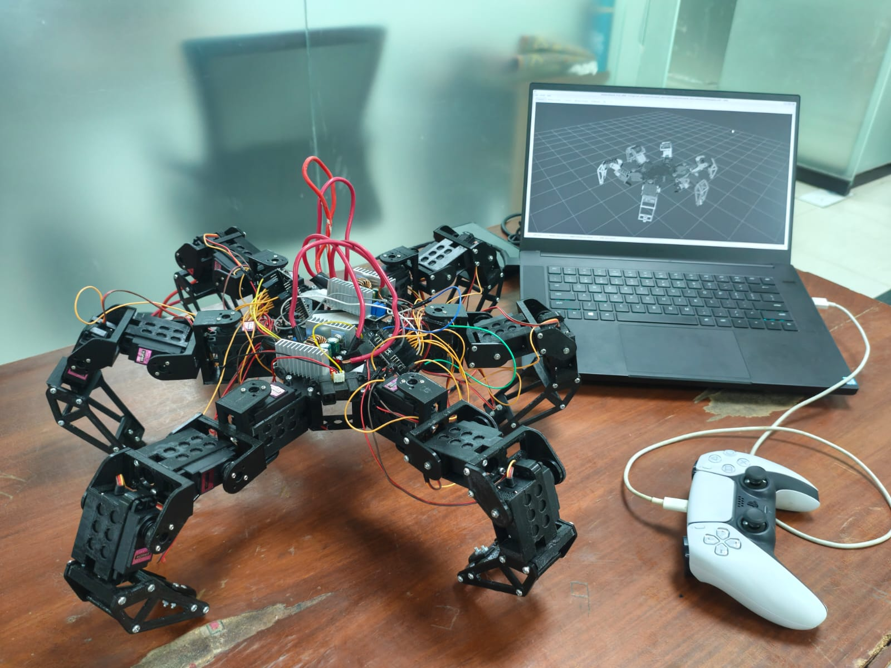

# CRAWL Hexapod – Motion Control System

## Overview

This repository contains the complete movement control system developed for the CRAWL Hexapod robot.

My primary contribution to the project was designing and implementing the robot's locomotion system, including:

- 🦿 Hexapod gait generation
- 🎮 PS5 DualSense controller integration
- ⚙️ Inverse kinematics based leg movement
- 📡 Master–Slave ESP32 communication 
- 🚶 Real-time walking, turning, and body height control

This project was completed at FAST NUCES ISLAMABAD as part of our Artificial Intelligence course

---

## Demo

<p align="center">
  
</p>

<p align="center">
  <a href="assets/hexa_vid.mp4">
    🎥 Watch Movement Demo
  </a>
</p>

---

# Project Architecture

The robot is powered by two ESP32 microcontrollers.

## Master ESP32

The master controller is responsible for:

- Connecting to the PS5 DualSense controller via Bluetooth
- Reading controller inputs
- Computing inverse kinematics for all six legs
- Generating gait timing and leg trajectories
- Driving Legs 1–3 directly
- Sending computed servo angles for Legs 4–6 to the slave ESP

## Slave ESP32
The Slave ESP32 was intentionally kept computationally lightweight, acting solely as a servo controller while the Master ESP32 handled all movement computations and gait generation.

It:

- Receives servo angle packets from the master
- Controls Legs 4–6
- Performs no inverse kinematics
- Performs no gait calculations

This architecture keeps all movement logic centralized while reducing computation on the secondary controller.

---

# Motion System

The motion system is divided into 2 gaits which can be chosen from the PS5 controller

## Ripple

Moves each leg forward, with the left and right leg moving alternatively

## Wave 
Moves leg from left to right in a circle 

---

# Vertical Body Movement

The locomotion system also supports dynamic body height adjustment.

Instead of only moving horizontally, each leg can be translated vertically by modifying its target position before inverse kinematics are solved.

This allows the robot to:

- Raise its body
- Lower its body
- Maintain a consistent walking height
- Produce smoother walking trajectories

The vertical motion is achieved without changing the robot's gait logic, making it easy to combine body height adjustments with normal movement.

---

# Inverse Kinematics

Rather than controlling servos directly, movement commands are converted into foot positions.

The inverse kinematics system calculates the required joint angles for each leg based on:

- Desired X position
- Desired Y position
- Desired Z position

Those calculated angles are then sent directly to the corresponding servos.

This approach produces natural and scalable movement while simplifying gait generation.

---

# PS5 Controller Integration

The robot supports wireless control using a PS5 DualSense controller.

Controller inputs are used for:

- Forward and backward movement
- Strafing
- Turning
- Direction changes
- Body movement commands

The Master ESP32 processes all controller input over Bluetooth and converts it into real-time gait commands.

---

# Features

- Six-legged coordinated locomotion
- Real-time gait generation
- Inverse kinematics
- Adjustable body height
- Smooth swing and stance phases
- Wireless PS5 controller support
- Master–Slave ESP32 architecture
- ESP-NOW communication
- Modular movement system

---

# Repository Contents

```
Hexapod_MASTER.ino
```

- PS5 controller interface
- Gait generation
- Inverse kinematics
- Servo control for Legs 1–3
- ESP-NOW transmission

```
Hexapod_SLAVE.ino
```

- ESP-NOW receiver
- Servo control for Legs 4–6
- Synchronized execution of received movement commands

---

# My Contribution

This repository showcases my work on the robot's locomotion system.

My responsibilities included:

- Designing the movement architecture
- Implementing gait generation
- Developing inverse kinematics based motion
- Integrating PS5 controller support
- Implementing Master–Slave communication using ESP-NOW
- Synchronizing all six legs for stable real-time walking

The focus of this work was creating a responsive, modular, and scalable movement system that can serve as the foundation for future autonomous behaviors.
